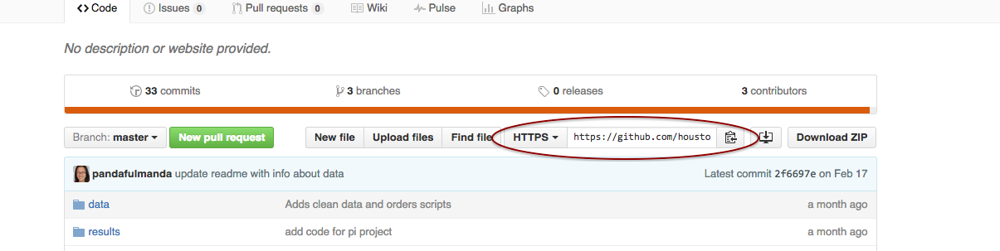
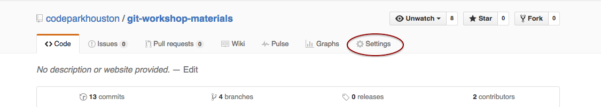
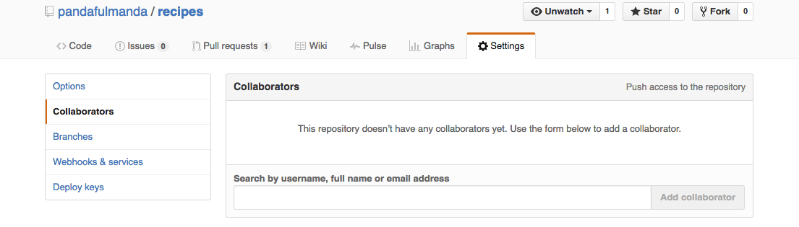

# Working Locally

[^1]

Just as we collaborated on GitHub on the recipes project, we can collaborate locally within the comfort of our text editor.  Pair up with a partner, and "clone" each other's repos onto your computers.

## Get a copy

First, **c**hange **d**irectory out of your current project. Then, get a copy of your partner's project by clicking on the clipboard icon next to the "Clone URL"



Run:

```bash
git clone <paste-clone-url-here>
```

Then, as before,

* Branch
  * `git checkout -b <branch-name>`
* Make edits
* Add
  * `git add <filename>`
* Commit
  * `git commit -m "commit message about the changes"`

When you're ready for your changes to go online, try:

```bash
git push origin <branch-name>
```

You will get a message about how you don't have permission to publish changes.  Add each other as collaborators, like how your mentor added you to the recipe's repo.

### Find your repo's Settings


### Then go to Collaborators


Add your partner's username.

Now, try to push to each other's repo once again.  Make PRs like before.


> **Info** Help your team as they continue to practice and help them grow confident and recognize the similarities of what they're doing now locally with what they did on GitHub earlier.


## Review

### Commands to tell git to make copies

| Command     | What it means | What it does |
| ----------- | ------------- | ------------ |
| `git clone ____` | **git**, **clone** the repo at the online address of ____ | Makes a copy from ____ to our computer |
| `git checkout -b ____` | **git**, **checkout** a new branch called _____ | Makes a copy of our project and remembers it by the name ____, and switches us to this copy |

[^1]: From [git-it](http://jlord.us/git-it/).

